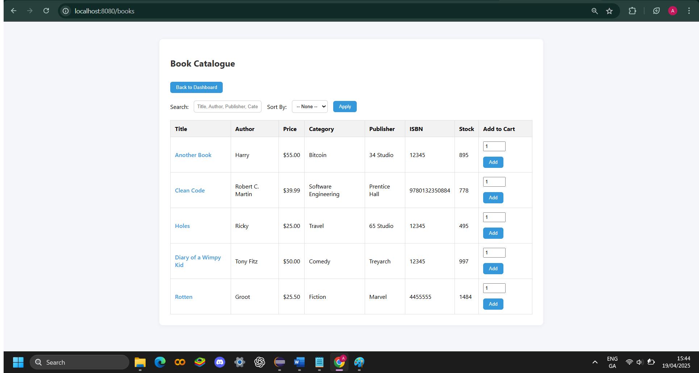

# Software Patterns Assignment 4 – Online Bookshop

## Overview

This project is a fully functional online Bookshop management system built using Java Spring Boot. It supports customer registration, book browsing, cart and checkout, order history, and includes an admin dashboard with full control over books, users, orders, and inventory.

---

## Key Features

- **Admin Dashboard**:
  - View statistics (total books, users, orders, revenue)
  - Manage books (CRUD)
  - Manage users (customer viewing with order history)
  - Manage inventory (stock updates)
  - View all orders

- **Customer Functionality**:
  - Register and log in securely
  - Browse books (search, filter, sort)
  - Add to cart and checkout
  - View past orders
  - Submit reviews

---

## Technologies Used

- Java 17
- Spring Boot
- Thymeleaf
- Spring Security
- MySQL
- JPA/Hibernate
- HTML5 / CSS3
- Maven

---

## Design Patterns Used

### 1. **Iterator Pattern** *(GoF)*
- **Purpose**: To traverse a collection of customers without exposing internal structure.
- **Where Used**: `manage-customers.html` page for admin.
- **Participants**:
  - `CustomerIterator`: Interface for iterating.
  - `CustomerListIterator`: Concrete iterator over `List<User>`.
  - `CustomerCollection`: Aggregate interface.
  - `CustomerList`: Concrete collection implementing the iterator pattern.

**Justification**: Cleanly separates iteration logic from user management logic and shows practical usage of GoF patterns in a real-world web app.

---

### 2. **Strategy Pattern** *(GoF)*
- **Purpose**: Allow dynamic sorting strategies for books (by title, price, stock).
- **Where Used**: Book sorting in `/admin/books` via query parameters.
- **Participants**:
  - Strategies implemented through repository methods like `findAllByOrderByTitleAsc()`, etc.
  - `AdminBookController` acts as the context, selecting a strategy based on the sort parameter.

**Justification**: Simplifies controller logic and follows OCP (Open/Closed Principle) for adding new sorting behaviors.

---

### 3. **MVC Pattern** *(Non-GoF but essential architectural pattern)*
- **Purpose**: Separation of concerns between business logic, UI, and data.
- **Where Used**: Throughout the entire Spring Boot application.
- **Participants**:
  - Model: Entities like `User`, `Book`, `Order`
  - View: Thymeleaf templates
  - Controller: Spring Controllers like `AdminController`, `AuthController`

**Justification**: Makes the system maintainable and testable, and is the industry standard in Spring Boot web apps.

---

### 4. **Repository Pattern** *(Non-GoF)*
- **Purpose**: Abstract data access logic from the business layer.
- **Where Used**: All database operations via interfaces like `BookRepository`, `OrderRepository`.
- **Participants**: Each repository interface abstracts CRUD operations over entity classes.

**Justification**: Encourages loose coupling and easy testing; aligns with Spring Data JPA.

---

### 5. **DTO-Like View Models** *(Implied non-GoF usage)*
- **Purpose**: Pass filtered or processed data to templates (e.g., performance stats).
- **Where Used**: Admin dashboard stats, filtered quiz results.
- **Participants**: Controller methods bundle data into `Model` attributes without exposing full entity logic.

**Justification**: Prevents over-fetching, protects sensitive fields, improves performance.

---

### Patterns Considered but Not Used

- **Factory Pattern**: Considered for user creation but Spring handles object instantiation through dependency injection.
- **Singleton Pattern**: Spring’s `@Component`-scoped beans already act as singletons.

---

## Screenshots

### Admin Dashboard

### Manage Books

### Add New Book

### Edit Book

### Book Sorting Options (Strategy Pattern)

### Manage Customers (Iterator Pattern)

### Customer Order History

### Register

### Login

### Customer Dashboard

### Book Catalogue (Customer Side)

### Cart

### Checkout / Order Confirmation

---

## How to Run

1. Clone the repo:  
   `git clone https://github.com/AdamFitzgibbon3108/SoftwarePatternsAssignment4.git`

2. Set up MySQL database:  
   - DB name: `bookshop_db`
   - Use schema from `/resources/schema.sql` if available.

3. Run the application:  
   `mvn spring-boot:run`

4. Access the app:  
   - Admin: `http://localhost:8080/admin/dashboard`  
   - Customer: `http://localhost:8080/register` or `/login`

---

# System Architecture & Database Report

## System Overview

The Online Bookshop is built using a layered architecture:

- **Presentation Layer**: Thymeleaf templates
- **Controller Layer**: Handles web requests
- **Service Layer**: (Optional in future work)
- **Repository Layer**: Interfaces to interact with DB
- **Data Layer**: JPA Entities map to tables

---

## Database Schema

### Tables:

1. **users**
   - `id`, `username`, `password`, `email`, `role`, `full_name`, `shipping_address`, `card_number`, `card_type`, `total_spent`, `created_at`

2. **book**
   - `id`, `title`, `author`, `publisher`, `price`, `category`, `isbn`, `image_url`, `stock`

3. **orders**
   - `id`, `user_id` (FK), `total_amount`, `order_date`

4. **order_items**
   - `id`, `order_id` (FK), `book_id` (FK), `quantity`, `price`

5. **review**
   - `id`, `user_id` (FK), `book_id` (FK), `rating`, `comment`, `created_at`

---

## Use Cases

### 1. Customer Registration
- Fill form with shipping/payment details
- Data saved in `users` table with role = CUSTOMER

### 2. Customer Book Browsing
- Search, filter, sort by title/price/category
- Books pulled from `book` table

### 3. Cart and Checkout
- Add items to cart
- On checkout: create `order`, store `order_items`, update `stock`, update `total_spent`

### 4. View Orders (Customer)
- User accesses order history
- Orders fetched by user ID

### 5. Admin Dashboard
- Access all data: `book.count()`, `user.count()`, `order.count()`, `SUM(total_amount)`

### 6. Manage Books
- Admin can create, update, or delete books
- Deleting a book will also remove related orders

### 7. Manage Customers
- Admin views all customers (Iterator Pattern)
- Can click to view individual customer order history

---

## Design Requirements

- Secure login system with role-based access (`ADMIN`, `CUSTOMER`)
- Admin-only access to dashboards and book management
- Use of GoF patterns (at least 2) — achieved via Iterator and Strategy
- Extendable and clean codebase using Spring Boot best practices

---

## Summary

This bookshop system delivers a full set of e-commerce functionalities while demonstrating strong application of software design principles and patterns. It is modular, maintainable, and ready for future enhancements like promotions, analytics, and REST API exposure.

